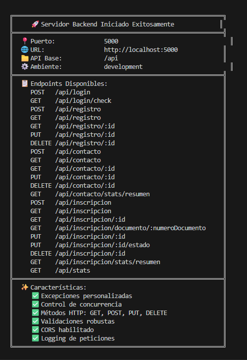

# SistemasTech - Portal de Ingeniería en Sistemas

Una aplicación web moderna y profesional desarrollada con React, Bootstrap y React Router para un programa de Ingeniería en Sistemas.

## 🚀 Características

- **Diseño Responsive**: Interfaz completamente adaptable a todos los dispositivos
- **Bootstrap 5**: Componentes UI modernos y profesionales
- **React Router**: Navegación fluida entre páginas
- **Paleta de Colores Profesional**: Diseño limpio con tonos azules corporativos
- **Código Limpio**: Separación de concerns con componentes, páginas y estilos

## 📸 Capturas de Pantalla

### Página Principal


### Página de Inicio
.png)

### Página de Login
.png)

### Página de Registro
.png)

### Página Sobre Nosotros
.png)

### Página de Curriculum
.png)

### Página de Admisiones
.png)

### Página de Contacto
.png)

### Formulario de Inscripcion
.png)

## 📁 Estructura del Proyecto

## � Capturas de Pantalla

### Página de Inicio

*Vista principal con información del programa de Ingeniería en Sistemas*

### Páginas del Sistema

<div align="center">
  
| Página de Inicio | Login | Registro |
|:---:|:---:|:---:|
| .png) | .png) | .png) |

| Sobre Nosotros | Currículum | Admisiones |
|:---:|:---:|:---:|
| .png) | .png) | .png) |

| Contacto | Formulario de Inscripción | Página 404 |
|:---:|:---:|:---:|
| .png) | .png) |  |

</div>

## �📁 Estructura del Proyecto

```
sistemas-web/
├── front/                      # Frontend de la aplicación
│   ├── components/            # Componentes reutilizables
│   │   ├── Header.jsx        # Encabezado principal
│   │   ├── Navigation.jsx    # Barra de navegación
│   │   └── Footer.jsx        # Pie de página
│   ├── pages/                # Páginas de la aplicación
│   │   ├── Home.jsx          # Página de inicio con slider
│   │   ├── Login.jsx         # Página de inicio de sesión
│   │   ├── Registro.jsx      # Página de registro
│   │   ├── Formulario.jsx    # Formulario de inscripción
│   │   └── NotFound.jsx      # Página de error 404
│   ├── styles/               # Archivos CSS separados
│   │   ├── Header.css
│   │   ├── Navigation.css
│   │   ├── Footer.css
│   │   ├── Home.css
│   │   ├── Login.css
│   │   ├── Registro.css
│   │   ├── Formulario.css
│   │   └── NotFound.css
│   └── utils/                # Utilidades y helpers
├── back/                     # Backend (reservado para futuras implementaciones)
├── src/                      # Código fuente de React
│   ├── App.js               # Componente principal con rutas
│   ├── App.css              # Estilos globales
│   ├── index.js             # Punto de entrada
│   └── index.css            # Estilos base
└── public/                   # Archivos públicos estáticos
```

## 🎨 Paleta de Colores

- **Primary**: #2563eb (Azul profesional)
- **Secondary**: #0891b2 (Cian)
- **Accent**: #06b6d4 (Turquesa)
- **Success**: #10b981 (Verde)
- **Warning**: #f59e0b (Ámbar)
- **Danger**: #ef4444 (Rojo)
- **Background**: #f8fafc (Gris claro)

## 📋 Páginas Disponibles

1. **Inicio (/)**: Página principal con carousel y tarjetas informativas sobre las áreas de estudio
2. **Login (/login)**: Formulario de inicio de sesión
3. **Registro (/registro)**: Formulario de creación de cuenta
4. **Inscripción (/formulario)**: Formulario completo de inscripción al programa
5. **Error 404**: Página de error para rutas no encontradas

## 🛠️ Tecnologías Utilizadas

- **React** 18.x - Biblioteca de JavaScript para construir interfaces de usuario
- **TypeScript** 4.9.5 - Superset de JavaScript con tipado estático
- **React Router DOM** 7.x - Enrutamiento declarativo para React
- **Bootstrap** 5.x - Framework CSS para diseño responsive
- **React Bootstrap** - Componentes de Bootstrap para React
- **Bootstrap Icons** - Iconografía moderna y profesional

## 📘 Implementación de TypeScript

Este proyecto incluye una implementación completa de **TypeScript** para mejorar la seguridad de tipos, mantenibilidad y experiencia de desarrollo.

### Archivos TypeScript Implementados

- ✅ **tsconfig.json** - Configuración de TypeScript con modo estricto
- ✅ **src/front/types/index.ts** - 10+ interfaces y tipos personalizados
- ✅ **src/front/utils/validationTS.ts** - 10 funciones de validación tipadas
- ✅ **src/front/pages/Login.tsx** - Componente de login con TypeScript
- ✅ **src/front/pages/Registro.tsx** - Componente de registro con TypeScript

### Conceptos de TypeScript Demostrados

1. **Interfaces y Tipos**: LoginFormData, RegistroFormData, ContactFormData, etc.
2. **Utility Types**: Partial<T>, Record<K,V>, keyof, typeof
3. **Tipos Literales**: 'Básica' | 'Profesional' | 'Humanística'
4. **Event Typing**: ChangeEvent<HTMLInputElement>, FormEvent<HTMLFormElement>
5. **Async/Await Typing**: Promise<void> en funciones asíncronas
6. **Type Guards**: Validación de tipos en runtime
7. **As Const Pattern**: Constantes inmutables tipadas
8. **Propiedades Opcionales**: campos? en interfaces

### Documentación TypeScript

Para ver la documentación completa de TypeScript en este proyecto, consulta:

- 📄 **TYPESCRIPT_IMPLEMENTATION_SUMMARY.md** - Resumen ejecutivo para el profesor
- 📄 **TYPESCRIPT_DOCUMENTATION.md** - Documentación técnica completa
- 📄 **TYPESCRIPT_EXAMPLES.md** - Ejemplos prácticos con comparaciones
- 📄 **TYPESCRIPT_ARCHITECTURE.txt** - Diagrama visual de arquitectura

## 🔧 Backend - Node.js + Express.js

El backend está completamente implementado con **Node.js** y **Express.js**, cumpliendo todos los requisitos académicos.

### Características del Backend

1. ✅ **Node.js + Express.js** - Framework web para Node.js
2. ✅ **Manejo de Excepciones** - 5 clases personalizadas de errores
3. ✅ **Control de Concurrencia** - Sistema de locks en la base de datos
4. ✅ **Métodos HTTP Completos**:
   - GET - Obtener recursos
   - POST - Crear recursos
   - PUT - Actualizar recursos
   - DELETE - Eliminar recursos

### Pruebas de Métodos HTTP

*Ejemplo de pruebas de los métodos HTTP implementados en el backend*

### Estructura del Backend

```
back/
├── controllers/           # Controladores (lógica de negocio)
├── routes/               # Rutas de la API
├── middleware/           # Middleware personalizado
├── exceptions/           # Excepciones personalizadas
├── database/            # Base de datos en memoria con concurrencia
├── utils/               # Validadores de datos
└── server.js           # Archivo principal
```

### API Endpoints

- **Login**: `/api/login` - Autenticación de usuarios
- **Registro**: `/api/registro` - CRUD de usuarios
- **Contacto**: `/api/contacto` - CRUD de mensajes
- **Inscripción**: `/api/inscripcion` - CRUD de inscripciones
- **Estadísticas**: `/api/stats` - Estadísticas generales

### Iniciar el Backend

```bash
cd back
npm install
npm start
```

El servidor se iniciará en `http://localhost:5000`

### Documentación del Backend

- 📄 **back/README.md** - Documentación básica
- 📄 **back/BACKEND_DOCUMENTATION.md** - Documentación completa técnica
- 📄 **back/PRUEBAS.md** - Guía de pruebas con cURL

## 🚀 Iniciar el Proyecto Completo

### Frontend (React):
```bash
npm start
```
Se abre en `http://localhost:3000`

### Backend (Node.js):
```bash
cd back
npm start
```
Se ejecuta en `http://localhost:5000`
- 📄 **TYPESCRIPT_DOCUMENTATION.md** - Documentación técnica completa
- 📄 **TYPESCRIPT_EXAMPLES.md** - Ejemplos prácticos con comparaciones
- 📄 **TYPESCRIPT_ARCHITECTURE.txt** - Diagrama visual de arquitectura

---

This project was bootstrapped with [Create React App](https://github.com/facebook/create-react-app).

## Available Scripts

In the project directory, you can run:

### `npm start`

Runs the app in the development mode.\
Open [http://localhost:3000](http://localhost:3000) to view it in your browser.

The page will reload when you make changes.\
You may also see any lint errors in the console.

### `npm test`

Launches the test runner in the interactive watch mode.\
See the section about [running tests](https://facebook.github.io/create-react-app/docs/running-tests) for more information.

### `npm run build`

Builds the app for production to the `build` folder.\
It correctly bundles React in production mode and optimizes the build for the best performance.

The build is minified and the filenames include the hashes.\
Your app is ready to be deployed!

See the section about [deployment](https://facebook.github.io/create-react-app/docs/deployment) for more information.

### `npm run eject`

**Note: this is a one-way operation. Once you `eject`, you can't go back!**

If you aren't satisfied with the build tool and configuration choices, you can `eject` at any time. This command will remove the single build dependency from your project.

Instead, it will copy all the configuration files and the transitive dependencies (webpack, Babel, ESLint, etc) right into your project so you have full control over them. All of the commands except `eject` will still work, but they will point to the copied scripts so you can tweak them. At this point you're on your own.

You don't have to ever use `eject`. The curated feature set is suitable for small and middle deployments, and you shouldn't feel obligated to use this feature. However we understand that this tool wouldn't be useful if you couldn't customize it when you are ready for it.

## Learn More

You can learn more in the [Create React App documentation](https://facebook.github.io/create-react-app/docs/getting-started).

To learn React, check out the [React documentation](https://reactjs.org/).

### Code Splitting

This section has moved here: [https://facebook.github.io/create-react-app/docs/code-splitting](https://facebook.github.io/create-react-app/docs/code-splitting)

### Analyzing the Bundle Size

This section has moved here: [https://facebook.github.io/create-react-app/docs/analyzing-the-bundle-size](https://facebook.github.io/create-react-app/docs/analyzing-the-bundle-size)

### Making a Progressive Web App

This section has moved here: [https://facebook.github.io/create-react-app/docs/making-a-progressive-web-app](https://facebook.github.io/create-react-app/docs/making-a-progressive-web-app)

### Advanced Configuration

This section has moved here: [https://facebook.github.io/create-react-app/docs/advanced-configuration](https://facebook.github.io/create-react-app/docs/advanced-configuration)

### Deployment

This section has moved here: [https://facebook.github.io/create-react-app/docs/deployment](https://facebook.github.io/create-react-app/docs/deployment)

### `npm run build` fails to minify

This section has moved here: [https://facebook.github.io/create-react-app/docs/troubleshooting#npm-run-build-fails-to-minify](https://facebook.github.io/create-react-app/docs/troubleshooting#npm-run-build-fails-to-minify)
# sistemas-web

